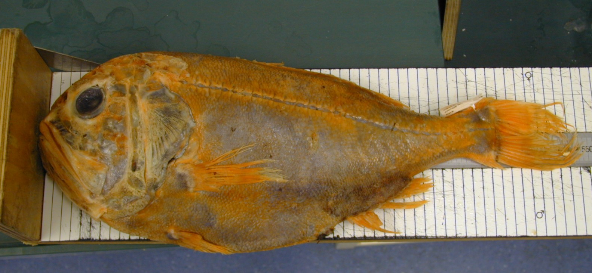
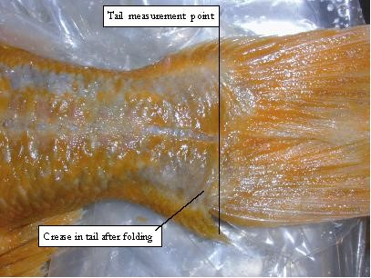

```{r setup, include=FALSE}
knitr::opts_chunk$set(
  echo=TRUE,
  warning = FALSE,
  message = FALSE,
  results = 'asis',
  fig.align = 'center')

#Load libraries
library(tidyverse)
library(gapminder)
library(kableExtra)
library(gifski)
library(gganimate)
library(scales)


Roughy<-read_csv("Results/OR87to2016.csv") %>% 
  mutate(Length = SLadj_cm)
```
# Introduction
I'm a biologist with CSIRO's Marine Resources and Industries working in the Acoustics & Pelagic Ecosystems Team. I manage the biological data and specimen collections within the group. This includes collecting, collating, standardising and analysing historical and new data. I learned to code at Data School. Prior to Data School I managed my data and conducted statistical analyses using Excel, Access and Systat.

# My Project:  Orange Roughy Eastern Zone Spawning Population Biomass Survey Data from 1987 to 2016
CSIRO has conducted acoustic and biological surveys from 1987 to the present to estimate the spawning biomass of Orange Roughy for stock assessment. Data from 2019 have been excluded from this report because of commercial in confidence concerns. The data used for this project were collected aboard commercial trawlers from the spawning grounds located on seamounts off the east coast of Tasmania. The biological data include standard length (cm), sex, weight, gonad stage and a record of samples collected such as otoliths for aging and tissue samples for fecundity and toxicity analyses. Biological measurements such as standard length, which have been consistently measured and recorded since the fishery began can be used to assess if there have been changes in population size structure over time.

## Preliminary results


**Tables**
---
Data wrangling and tidying is very time consuming but that is nothing new! The survey data were collected by different researches and projects it was necessary to standardise the datasets from the various surveys. Table 2 shows my tidy data.

```{r mytable, out.width='100%', echo = T}
knitr::kable(tail(Roughy, n = 5), format = "html", caption = "My tidy data") %>% 
  kableExtra::kable_styling("striped") %>%
  kableExtra::scroll_box(width = "100%")

```

**How to measure the standard length of an orange roughy**
--
The Standard Length of an orange roughy is measured from the tip of the snout to the end of the hypural plate. The figures below show the location of the hypural plate. 


{width=1000px}|
{width=1000px}

**Plots from R**
--

Figure 1 shows the length frequency distrubtion by year. The vertical line represents size at maturity (30 cm)
```{r myfig1, echo=FALSE, fig.align='center', fig.cap="Length frequencies by year and Area", message=FALSE, warning=FALSE, out.width='100%'}
#filter(Roughy, Area_MS == "St Helens") %>% 
  
ggplot(Roughy, aes(x=Length, fill = sex)) +
geom_histogram(binwidth=.5, alpha= 1)+
 geom_vline(xintercept = 30, size = .01)+
  facet_wrap(~ year)+
  #facet_grid(Area_MS ~ year)+
  ##add animation
    #transition_reveal(year)+
  theme_bw()

#ggplot(data = RoughyF, mapping = aes(Length)) + 
 # geom_histogram() +
#ggplot(data = RoughyM, mmapping = aes(Length))+
 # geom_histogram()+
  #facet_wrap(~ year)


#SLrange<-  max(Roughy$Length) - min(Roughy$Length) 
#binssize <- 10
#class_interval <- SLrange / binssize
#lower_limit <- seq(min(Roughy$Length), max(Roughy$Length),by = class_interval)-0.1
#upper_limit <- (lower_limit + class_interval)  -0.1
#df_bin <- as.data.frame(cbind(lower_limit,upper_limit))
#df_bin <- df_bin %>% 
#  mutate(midlength = lower_limit + upper_limit / 2)
#nrow((df_bin)
```

Figure 2 shows the length to weight relationship for the surveys that collected weight data. The black line represents the expected relationship for both sexes (Weight = 0.037 * Length ^ 2.942) as per Lyne (1991).  
```{r myfig2, out.width='100%', fig.align='center', fig.cap= "Length vs Weight, showing the predicted values (Lyle 1991)"}
Lyle_com <- function(x) {(0.037 * (x) ^ 2.942)/1000}

  RoughyWeight<- Roughy %>% 
  drop_na(weight_kg) %>% 
  filter(weight_kg != 0)
  

ggplot(data = RoughyWeight,
       mapping = aes(x  = Length,
                     y = weight_kg, colour = as.factor(year))) +
  geom_point()+
  stat_function(fun = Lyle_com, colour ="black")+
  facet_wrap(~year)

#Your figure and table captions are automatically numbered and can be referenced in the text
#if needed: see eg. Table \@ref(tab:mytable) and Figure \@ref(fig:standard-plot)

```


```{r linear regression}
#regression <- lm(year ~ SLadj_cm + sex + Area_MS, data = Roughy)


#Short summary of the model
#regression

#Longer summary of the model
#Esummary(regression)
```

# My Digital Toolbox

At Data School Focus I have learned to use the following packages:

* tidyverse
* ggplot2
* dplyr
* kableEtra
* readr
* tidyr
* tibble
* ggannimate (in progress)


# My time went ...

I spent most of my time tidying my data. I am very impressed with the way coding enables all the steps and choices made during the tidying and data wrangling process to be docuumented. 

# Next steps
I will continue to explore visualising with ggplot look deeper into statistical analyses. My very next step will be to use geom_smooth to fit log curve to the length-weight data and compare the predicted to the expected relationship. I am also interested to learn gganimate. Annimation would be an efficient method to show population changes over time for the orange roughy length frequency data. I will then progress to tidy my other datasets, in particular I am interested using ggannimate to explore our Micronekton (animals < 2cm) datasets. I think gganimate would be a useful tool to demonstrate the diurnal movement of  Micronekton from deeper waters in the day to surface water at night, this phenomenon  is referred to as the “biological pump”.

# My Data School Experience

Data School has been a very useful and rewarding experience and has changed the way I do my job. I can now manage and document my data wrangling which was previously recorded in notebooks and reports.  This has been hugely transformative as much of my job involves collating data from different researchers and projects with varied field and data management practices. I am also very grateful for the encouragement, patience and kindness of the Data School Focus team who made the learning process fun and manageable.
